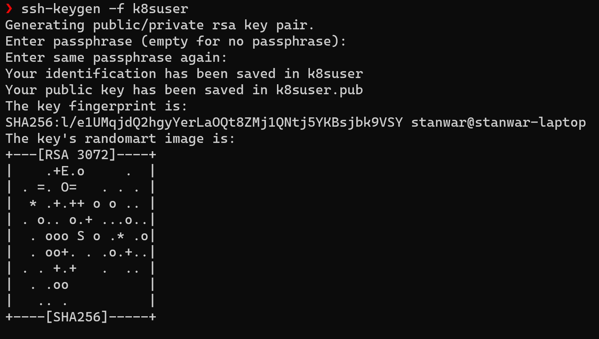
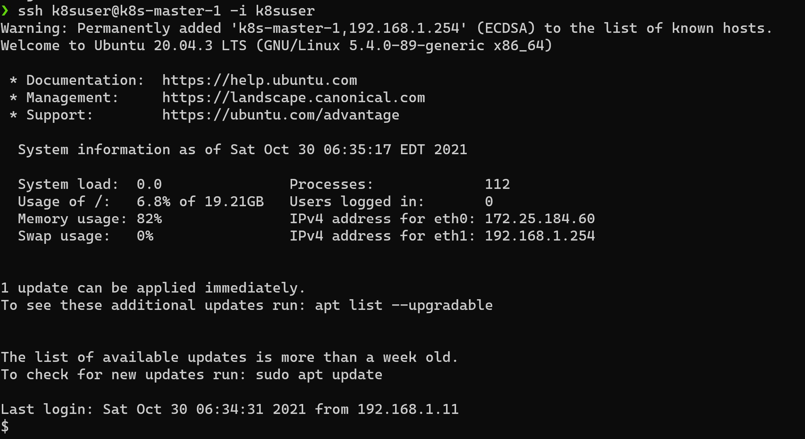

During preparation for my **Certified Kubernetes Administrator** (CKA) and **Certified Kubernetes Security Specialist** (CKS) exams I realized the value of having a local Kubernetes cluster that can be used to experiment. Initially, I followed the instructions from [kubernetes-the-hard-way](https://github.com/kelseyhightower/kubernetes-the-hard-way) by **Kelsey Hightower** and manually built a local cluster on my Windows 10 laptop.

<!--more-->

It was a great starting point to experiment, but I faced many challenges with the manual installation. While experimenting much of my time was getting wasted in either identifying the changes that made the cluster unusable or in rebuilding the cluster again when not able to find the root cause of failure. This made me realize that I need an automated and repeatable solution to build a local cluster. As the process would allow me to focus on experimenting with various Kubernetes concepts instead of fixing or building clusters if some issue occurs.

## The Plan

When I started to look around, I found many tools to build a local cluster, such as [k3sup](https://github.com/alexellis/k3sup), [k8s-tew](https://github.com/darxkies/k8s-tew) and [kOps](https://github.com/kubernetes/kops#installing), etc. All of them are straightforward tools, but I wanted a solution that will allow me to follow the steps defined as part of [kubernetes-the-hard-way](https://github.com/kelseyhightower/kubernetes-the-hard-way). I narrowed it down to using bash scripts to automate the required steps for the cluster creation. Scripting would save a lot of effort in creating a cluster or bringing back a non-functioning cluster to its starting state. In addition to that, with the scripts, it's easier to tinker and test various combinations for cluster creation with minimum effort.

---

## The Solution

The solution I developed includes multiple scripts for the cluster creation workflow. Having multiple scripts targeting specific steps allowed easy experimentation and fixing any specific issues with that step. The scripts are divided into different groups targeting the generation of cert authority and other required certificates, installing and configuring control plane components, installing and configuring worker node components, configuring network components, and validating the cluster installation by deploying. The scripts need to be executed in a specific order from a Linux shell.

> The scripts are available as [k8s-bare-metal](https://github.com/tanwarsatya/k8s-bare-metal) repository on **GitHub.com**

 Feel free to download them and experiment in your way. In subsequent sections, I will be covering different prerequisites required, the structure of scripts, and the functionality they cover.

### Prerequisites

Following are the prerequisites required for installation

>#### 1. Linux Shell to run bash scripts
>
>If using a Windows 10/11 based laptop or desktop you can [enable :desktop_computer: WSL2](https://docs.microsoft.com/en-us/windows/wsl/install#manual-installation-steps) to get a Linux shell.
>
>#### 2. Install/Update GIT on WSL
>
> Git comes installed on WSL still make sure it's installed and update it to the latest version by following this tutorial [Using GIT on WSL ](https://docs.microsoft.com/en-us/windows/wsl/tutorials/wsl-git)
>
>#### 3. Physical or Virtual machines running Ubuntu (18.04 or 20.04) with key based authentication
>
>If you don't have access to physical machines, VMs can be another alternative to meet this requirement. For installing VMs you can utilize [Multipass](https://multipass.run/) from Canonical.
>
>`:pushpin: Multipass is a mini-cloud on your workstation using native hypervisors of all the supported plaforms (Windows, macOS and Linux), it will give you an Ubuntu command line in just a click (“Open shell”) or a simple multipass shell command, or even a keyboard shortcut.'`
>
>Follow the steps given below to instantiate required VMs for the cluster:
>
>- [Enable Hyper-V](https://docs.microsoft.com/en-us/virtualization/hyper-v-on-windows/quick-start/enable-hyper-v) if you are using Windows based PC.
>
>- Install [Multipass](https://multipass.run/) on your PC.
>
>- Create an [external switch in Hyper-V](https://docs.microsoft.com/en-us/windows-server/virtualization/hyper-v/get-started/create-a-virtual-switch-for-hyper-v-virtual-machines) with a name - ***Multipass***. This will help in adding a secondary interface to the provisioned VMs with a local IP address and make VMs visible on the local network. We need to connect to VMs from the Linux shell to execute installation steps remotely.
>
>     
>
>
>- Generate OpenSSH private/public key pair to be used for key-based authentication for VMs. You can use [ssh-keygen](https://docs.github.com/en/authentication/connecting-to-github-with-ssh/generating-a-new-ssh-key-and-adding-it-to-the-ssh-agent) command on WSL to generate private/public key pair. For simplicity use an empty passphrase.
>
>     
>
>
>- Create a [cloud_init.yaml](https://cloudinit.readthedocs.io/en/latest/) file to be used for vm creation. Multipass allow using ***cloud_init.yaml*** to configure instantiated VMs. This way we can easily automate the required configuration of newly generated VMs. Follow the basic template example given below and replace the password and ssh_authorized_keys field values.
>
>
>     ```yaml
>     users:
>       - default
>         - name: k8suser
>           lock_passwd: false
>           plain_text_passwd: 'yourpassword'
>           sudo:  ALL=(ALL) NOPASSWD:ALL
>           ssh_authorized_keys:
>             - ##.pub key filecontent##
>     ssh_pwauth: True 
>     ```
>
>- Provision virtual machines using Multipass with the following commands. Feel free to change the parameters as required.
>
>     ```bash
>       multipass launch -n=k8s-master-1 --network name=multipass,mode=auto 
>       -c=2 -m=4G  -d=20G --cloud-init=cloud-init.yaml
>     ```
>
>     ```bash
>       multipass launch -n=k8s-node-1 --network name=multipass,mode=auto 
>       -c=2 -m=4G  -d=20G --cloud-init=cloud-init.yaml
>     ```
>
>     ```bash
>       multipass launch -n=k8s-node-2 --network name=multipass,mode=auto 
>       -c=2 -m=4G  -d=20G --cloud-init=cloud-init.yaml
>      ```
>
>- Make sure virtual machines are in started state and have a local IP address assigned to it. You should be able to ping it.
>
>    
>
> - Make sure you are able to log in via ssh with the private key from the key-pair generated in the above step.
>
>    

---
## Structure

The scripts are arranged as per the below structure and grouped mainly under **3 folders** and various **numbered scripts**. In the following section, I am going to review the purpose of the specific folder/files. You should be able to click on the link, and it will take you to the correct artifact in the repository.

```bash
k8s-bare-metal
|
└───cert-authority
│   └───bin
|   └───config
|   └───certs (generated during execution)
│   
└───control-plane
|   └───config
|   └───output (generated during execution)
|
└───worker-plane
|   └───config
|   └───output (generated during execution)
|
|
|   1_install_control_plane.sh
|   2_install_worker_plane.sh
|   3_install_network_plane.sh
|   4_verify_cluster.sh
|   variables.sh
```

### Cert-Authority

The [cert-authority](https://github.com/tanwarsatya/k8s-bare-metal/blob/main/cert-authority) contains scripts and configuration files to generate required CA Root and certs used by k8s.

```bash
k8s-bare-metal
│
└───cert-authority
│   │   generate_ca_cert.sh
│   │   README.md
|   |
│   └───config
│       │   ca-config.json
│       │   ca-csr.json    
```

**[config](https://github.com/tanwarsatya/k8s-bare-metal/blob/main/cert-authority/config)** folder contains ca-config.json and ca-csr.json files to be used by cfssl/cfssljson to generate certs. Only CA Root will be generated by these configs.

**[generate_ca_cert.sh](https://github.com/tanwarsatya/k8s-bare-metal/blob/main/cert-authority/generate_ca_cert.sh)** script create a certs directory and uses config files and download binaries to generate CA inside the certs directory.

### Control-plane
  
The [control-plane](https://github.com/tanwarsatya/k8s-bare-metal/blob/main/control-plane) contains scripts and configs to generate required YAML configuration and scripts to install control-plane components on Linux nodes

```bash
k8s-bare-metal
│
└───control-plane
|   │   generate_control_plane_certs.sh
|   |   generate_control_plane_configs.sh
|   |   generate_control_plane_services.sh
|   |   install_etcd.sh
|   |   install_haproxy.sh
|   |   install_k8s.sh
|   │   README.md   
|   │
│   └───config
│       │   admin-csr.json
│       │   encryption-config.json
|       |   etcd-csr.json
│       │   kube-apiserver-csr.json
│       │   kube-controller-manager-csr.json
│       │   kube-scheduler-csr.json
│       │   kubelet-auth-role-binding.yaml
│       │   kube-auth-role.yaml
│       │   kubelet-auto-approve-csr-role-binding.yaml
│       │   kubelet-auto-approve-renewals-role-binding.yaml
│       │   kubelet-csr-role-binding.yaml
│       │   kubernetes.default.svc.cluster.local
│       │   service-account-csr.json 
```

**[config](https://github.com/tanwarsatya/k8s-bare-metal/blob/main/control-plane/config)** folder include various config and binding files required for control-plane components as shown above.

**[generate_control_plane_certs.sh](https://github.com/tanwarsatya/k8s-bare-metal/blob/main/control-plane/generate_control_plane_certs.sh)** bash file generates required certs for control-plane components and save the generated files inside **output** folder.

**[generate_control_plane_configs.sh](https://github.com/tanwarsatya/k8s-bare-metal/blob/main/control-plane/generate_control_plane_configs.sh)** bash file generates various config files with appropriate token and values based on parameters defined in [variables.sh](https://github.com/tanwarsatya/k8s-bare-metal/blob/main/variables.sh). The script generates following files

- kube-controller-manager.kubeconfig
- kube-scheduler.kubeconfig
- kube-scheduler.yaml
- admin.kubeconfig
- haproxy.config (if more than one node is used for control-plane installation)
- .kubeconfig

**[generate_control_plane_services.sh](https://github.com/tanwarsatya/k8s-bare-metal/blob/main/control-plane/generate_control_plane_services.sh)** bash file generates various service configuration files with appropriate token and values based on parameters defined in [variables.sh](https://github.com/tanwarsatya/k8s-bare-metal/blob/main/variables.sh). The script generates following files

- etcd.service
- kube-apiserver.service
- kube-controller-manager.service
- kube-scheduler.service

**[install_etcd.sh](https://github.com/tanwarsatya/k8s-bare-metal/blob/main/control-plane/install_etcd.sh)** bash file installs etcd components for control-plane nodes as per the nodes defined in [variables.sh](https://github.com/tanwarsatya/k8s-bare-metal/blob/main/variables.sh) file at parent folder level. This script uses various output artifacts generated by other scripts.

**[install_haproxy.sh](https://github.com/tanwarsatya/k8s-bare-metal/blob/main/control-plane/install_haproxy.sh)** bash file installs hxproxy components to access kube-apiserver when more than one control-plane nodes is specified in [variables.sh](https://github.com/tanwarsatya/k8s-bare-metal/blob/main/variables.sh) file

**[install_k8s.sh](https://github.com/tanwarsatya/k8s-bare-metal/blob/main/control-plane/install_k8s.sh)** bash file installs all the required components for control-plane on each control-plane nodes as specified in [variables.sh](https://github.com/tanwarsatya/k8s-bare-metal/blob/main/variables.sh)

### Worker-plane
  
The [worker-plane](https://github.com/tanwarsatya/k8s-bare-metal/blob/main/worker-plane) contains scripts and configs to generate required YAML configuration and scripts to install worker-plane components on Linux nodes

```bash
k8s-bare-metal
|
└───worker-plane
    |   generate_worker_plane_certs.sh
    |   generate_worker_plane_configs.sh
    |   generate_worker_plane_services.sh
    |   install_k8s.sh
    │   README.md
    │
    └───config
        │   config.toml
        │   kube-proxy-csr.json
```

**[config](https://github.com/tanwarsatya/k8s-bare-metal/blob/main/worker-plane/config)** folder include various config files required for worker-plane components as shown above.

**[generate_worker_plane_certs.sh](https://github.com/tanwarsatya/k8s-bare-metal/blob/main/worker-plane/generate_worker_plane_certs.sh)** bash file generates required certs for worker-plane components and save the generated files inside **output** folder.

**[generate_worker_plane_configs.sh](https://github.com/tanwarsatya/k8s-bare-metal/blob/main/worker-plane/generate_worker_plane_configs.sh)** bash file generates various config files with approproate token and values based on parameters defined in [variables.sh](https://github.com/tanwarsatya/k8s-bare-metal/blob/main/variables.sh) file at parent directory level. The script generates following files

- kube-proxy.kubeconfig
- kube-proxy-config.yaml
- kubelet-config.yaml
- kubelet.kubeconfig (for each worker node specified in variables.sh file)

**[generate_control_plane_services.sh](https://github.com/tanwarsatya/k8s-bare-metal/blob/main/worker-plane/generate_control_plane_services.sh)** bash file generates various service configuration files with appropriate token and values based on parameters defined in [variables.sh](https://github.com/tanwarsatya/k8s-bare-metal/blob/main/variables.sh). The script generates following files

- kube-proxy.service
- kubelet.service
- containserd.service

**[install_k8s.sh](https://github.com/tanwarsatya/k8s-bare-metal/blob/main/worker-plane/install_k8s.sh)** bash file installs all the required components for worker-plane on each node as specified in [variables.sh](https://github.com/tanwarsatya/k8s-bare-metal/blob/main/variables.sh) file

### 1_install_control_plane.sh
  
  [1_install_control_plane.sh](https://github.com/tanwarsatya/k8s-bare-metal/blob/main/1_install_control_plane.sh) act as a workflow and uses various scripts from the control-plane folder to installs various control plane components on master nodes, it also generates CA root certs as a first item using the scripts from cert-authority.

### 2_install_worker_plane.sh
  
  [2_install_worker_plane.sh](https://github.com/tanwarsatya/k8s-bare-metal/blob/main/2_install_worker_plane.sh) act as a workflow and uses various scripts from the worker-plane folder to installs various worker plane components on worker nodes.

### 3_install_network_plane.sh
  
  [3_install_network_plane.sh](https://github.com/tanwarsatya/k8s-bare-metal/blob/main/3_install_network_plane.sh) act as a workflow to installs CNI networking plugin components on cluster. This script also configure the local kubeconfig to use kubectl from the local shell.

### 4_verify_cluster.sh
  
   [4_verify_cluster.sh](https://github.com/tanwarsatya/k8s-bare-metal/blob/main/4_verify_cluster.sh) validates the cluster by checking various kubernetes services status, nodes status and also deploy random number of nginx pods to make sure cluster is up and running.

---

  In upcoming second part [2 - Scripting kubernetes-the-hard-way](/posts/technology/2-scripting-kubernetes-the-hard-way/) of this blog, I will explain the requirements and go through the installation steps. Again just to mention scripts are available as part of [k8s-bare-metal](https://github.com/tanwarsatya/k8s-bare-metal) repository on GitHub.com.
  