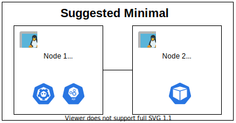
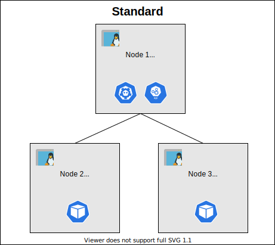
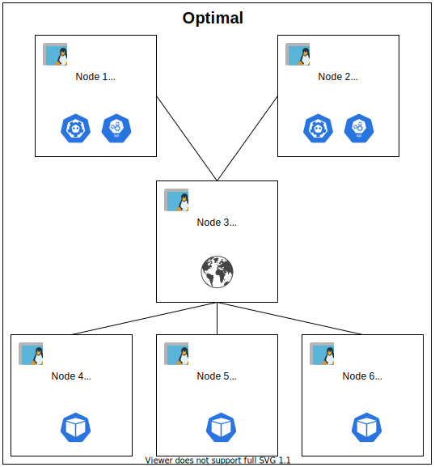
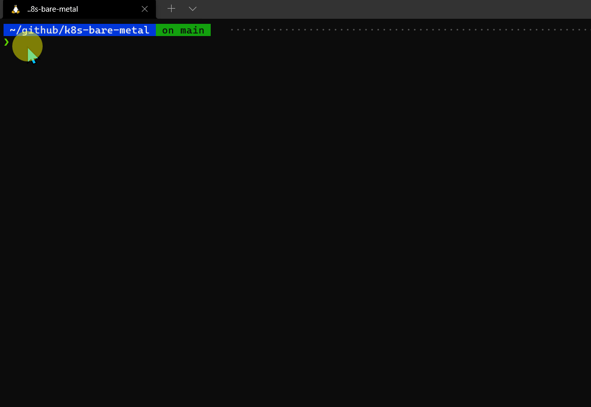
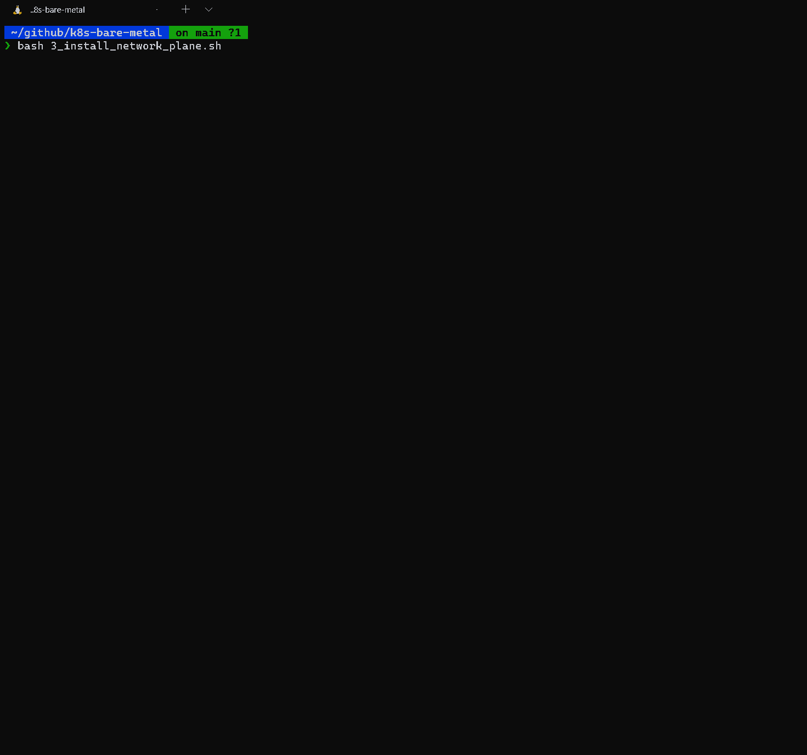

In the earlier post, [1 - Scripting kubernetes-the-hard-way](/posts/technology/1-scripting-kubernetes-the-hard-way/) we discussed that I developed the scripts to save time when experimenting with local kubernetes, and later we reviewed the structure and purpose of the scripts. In this part, we will continue looking at the requirements for installation and perform the installation afterwards.

<!--more-->
---
## Requirements

>Installation can be done with any of the following suggested configurations, and the Linux nodes' requirements directly depend on the configuration selected. Use any of the suggested node configurations for installation. If choosing a configuration that uses more nodes you can lower down the CORE, RAM, and DISK requirements mentioned below.
>
>`:computer: Node Configuration - 2 CORE, 4 GB RAM , 20 GB DISK`
>
>- ***Bare Minimum*** - 1 Linux node is required for the bare minimum installation of the Kubernetes cluster. This single node will host all the control-plane components and worker-plane components. Any applications/pod deployed will run on this node.
>
> 
>  
>
>- ***Suggested Minimal*** - 2 Linux nodes are required for the suggested minimal installation of the Kubernetes cluster. 1st Linux node will host all the control-plane and the 2nd Linux node will host all the worker-plane components. Based on configuration application/pods can be deployed on worker-node or both the nodes.
>
>
> 
> 
>- ***Standard*** - 3 Linux nodes are required for the standard installation of the Kubernetes cluster. 1st Linux node will host all the control-plane and the 2 Linux nodes will host the worker-plane components. 2 worker-nodes will be used for application/pods deployments.
>
> 
>
>- ***Optimal*** - 6 Linux nodes are required for the optimal installation of the Kubernetes cluster. 2 Linux nodes will host control-plane components in a highly available configuration. 1 Linux will host haproxy for being a proxy to access kube-apiserver in a load balanced way. 3 worker nodes will be used for application/pods deployments.
>
> 
> 
>- ***Realistic*** - 8 Linux nodes are required for the realistic installation of the Kubernetes cluster. 2 Linux nodes will host ETCD components in a highly available configuration. 2 Linux nodes will host control-plane components in a highly available configuration. 1 Linux will host haproxy for being a proxy to access kube-apiserver in a load-balanced way. 3 worker nodes will be used for application/pods deployments.
>
> 
> 
---
## The Installation

For a successful installation first prepare the environment and later perform the execution of steps in given order

### Preparation

- Identify the configuration from the [Requirements'](#requirements) section you like to use for your installation and based on that create several VMs using ***Multipass*** as mentioned in the [Prerequisite](#prerequisites) section. Skip creating VMs if you are using physical machines on your local network.

- Make sure you can ssh into the VMs created via key-based authentication, as the same method will be used by the scripts to remotely install and configure the components.

- Clone the [k8s-bare-metal](https://github.com/tanwarsatya/k8s-bare-metal) repository to your shell environment.

  

- Copy the private key file you used to ssh into VMs, this key will be used by the scripts to remote into VMs specified. For this example, I have named the private key file as ***k8suser***.

  

- Review the [variables.sh](https://github.com/tanwarsatya/k8s-bare-metal/blob/main/variables.sh) file at root directory level where you cloned the GitHub repository. And update the variables as per your configuration. The below example is for ***Standard Configuration*** using 3 Linux nodes to install the cluster.  For variable SSH_CERT specify the private key file name and make sure the private key is available at the same level of variables.sh file.

  ```bash
  # User name and key file for remote login on VMs for deploying cluster component
  SSH_USER="k8suser"
  SSH_CERT="k8suser"

  # Cluster Name
  CLUSTER_NAME="easy-k8s-cluster"

  #VM and Node Name
  #############################################
  declare -a CONTROL_PLANE_NODES=("k8s-master-1")
  declare -a CONTROL_PLANE_ETCD_NODES=("k8s-master-1")
  declare -a WORKER_PLANE_NODES=("k8s-node-1" "k8s-node-2")
  CLUSTER_API_LOAD_BALANCER="k8s-master-1"

  #Network Range and CNI
  #############################################
  # Cluster cidr
  CLUSTER_CIDR="10.32.0.0/12"
  # Cluster Service CIDR
  CLUSTER_SVC_CIDR="10.32.0.0/16"
  # choose a provide from list [kube-router , calico , cilium ]
  CLUSTER_CNI_PROVIDER="cilium"
  ```

### Execution

Execute the following steps in defined order, in case you encounter any error review the log produced and try to fix the issue. In case there were some intermittent issues related to network just run the steps again. Most of the time intermittent issues will resolve if not you can also try to create the vm again and run the scripts as a fresh installation.

- Execute the script [1_install_control_plane.sh](https://github.com/tanwarsatya/k8s-bare-metal/blob/main/1_install_control_plane.sh) to install control-plane components

  

- Execute the script [2_install_worker_plane.sh](https://github.com/tanwarsatya/k8s-bare-metal/blob/main/2_install_worker_plane.sh) to install worker-plane components

  

- Execute the script [3_install_network_plane.sh](https://github.com/tanwarsatya/k8s-bare-metal/blob/main/3_install_network_plane.sh) to install network-plane components

  

- Execute the script [4_verify_cluster.sh](https://github.com/tanwarsatya/k8s-bare-metal/blob/main/4_verify_cluster.sh) to verify cluster is running as expected

  

:boom: Awesome you should have a working cluster now. Sometimes the nodes may have a status not ready when you use lower configuration for your Linux nodes. Give it some time and use the kubectl to get the node status in 2-3 minutes. The script updates the local kubeconfig so that you can use kubectl from the WSL shell. Once you have a working cluster feel free to experiment and tinker with ***[variables.sh](https://github.com/tanwarsatya/k8s-bare-metal/blob/main/variables.sh)*** file and other scripts in different folders to get a better understanding of the steps required to install Kubernetes manually. Scripts are idempotent and can be executed multiple times, which will reset the cluster to its initial state. In case for any reason if the cluster is not showing ready status, please try to run the scripts again as that fixes an intermittent issue with the installation. You can run individual scripts as well to just install the specific component and verify them at your own pace. Fork the repo and change the scripts to learn more.

---
## Summary

[kubernetes-the hard-way](https://github.com/kelseyhightower/kubernetes-the-hard-way) by **Kelsey Hightower** is the gold standard for learning internals of Kubernetes working. You can avoid the time-consuming nature of Kubernetes installation by utilizing the scripts I developed. These scripts closely follow the **Kelsey Hightower's** steps and allow any kind of experimentation you want to try. Scripts are available as part of [k8s-bare-metal](https://github.com/tanwarsatya/k8s-bare-metal) repository on GitHub.com. I hope this will save some of your valuable time and don't forget to share this blog and scripts if this helped you in your learning :thumbsup:.
