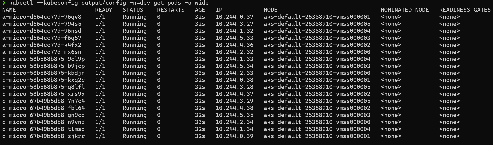

As part of a recent prototype activity, one of the requirements was to deploy the container based Microservices in an efficient and resilient manner on a Kubernetes cluster that has nodes spread across multiple zones. First, we will review various scaling scenarios required, and later in the post I will share details on how to use ***Well-Known Labels***,  ***pod topology spread constraints*** and ***pod affinity***  Kubernetes concepts to achieve our goal.

<!--more-->

## The Challenge

To get a clear understanding and to visualize how the actual topology should look like we will assume the following environmental setup and application design.

- An application named ***'myApp'*** that consist 3 Microservices
  - ***a-micro***
  - ***b-micro***
  - ***c-micro***


&nbsp;

- An ***Azure Kubernetes Service (AKS)*** cluster in East US region.  
- Default node pool of ***6 nodes*** spread across ***3 zones***, having ***2 nodes in each zone***


&nbsp;

---

### Goals

Given the above environment and application design following goals need to be achieved.

>- ***Microservices deployed should spread equally across the multiple zones***
>- ***Microservices that are part of an app runs on the same node to minimize latency***
>- ***All nodes are utilized in an efficient way to host the Microservices***
>- ***Scaling up of Microservices distribute them equally across zones and nodes***

Following deployment scenarios needed to be covered as part of the listed goals.


&nbsp;

---

## Kubernetes Concepts

In subsequent sections, we will review how 3 important Kubernetes concepts [Well-Known Labels](https://kubernetes.io/docs/reference/labels-annotations-taints/), [Pod Topology Spread Constraint](https://kubernetes.io/docs/concepts/workloads/pods/pod-topology-spread-constraints/) and [Inter-Pod-Affinity](https://kubernetes.io/docs/concepts/scheduling-eviction/assign-pod-node/#inter-pod-affinity-and-anti-affinity) are used to achieve the above-listed goals.

### Well-Known Labels

When you create an AKS cluster that is spread across multiple zones, AKS uses Kubernetes reserved [Well-Known Labels](https://kubernetes.io/docs/reference/labels-annotations-taints/) to mark the nodes with zone information they belong to. Well-Known labels are created and populated automatically on most types of Kubernetes clusters. For the solution, we will be using below mentioned 3 specific Well-Known Labels

- ***topology.kubernetes.io/region***
- ***topology.kubernetes.io/zone***
- ***kubernetes.io/zone***

### Pod Topology Spread Constraint

To spread your pod across zones, nodes, or any other user-defined topology domains you can use [Pod Topology Spread Constraint](https://kubernetes.io/docs/concepts/workloads/pods/pod-topology-spread-constraints/). This helps in making sure that pods are deployed in a manner to utilize resources efficiently and avoid single domain failures. This constraint can either be applied on ***Pod*** or at ***Cluster*** level and utilizes the ***Well-Known Labels*** we reviewed above.
#### [Default Topology Constraints](https://kubernetes.io/docs/concepts/workloads/pods/pod-topology-spread-constraints/#internal-default-constraints)

These constraints are applied at cluster level and only applied to pod only if

- Pod don't have its topology spread constraint defined
- Pod is part of the service, replica, or deployment set.
```
defaultConstraints:
  - maxSkew: 3
    topologyKey: "kubernetes.io/hostname"
    whenUnsatisfiable: ScheduleAnyway
  - maxSkew: 5
    topologyKey: "topology.kubernetes.io/zone"
    whenUnsatisfiable: ScheduleAnyway
```

#### [Pod Constraint](https://kubernetes.io/docs/concepts/workloads/pods/pod-topology-spread-constraints/#spread-constraints-for-pods)

You can define one or more topology spread constraints for a pod. Kubernetes scheduler will use the defined constraint when actual pod deployment will be based on a combination of all the constraints configured for that pod. A defined pod constraint will override the default cluster constraint for that pod placement.

```
apiVersion: v1
kind: Pod
metadata:
  name: mypod
spec:
  topologySpreadConstraints:
    - maxSkew: <integer>
      topologyKey: <string>
      whenUnsatisfiable: <string>
      labelSelector: <object>
```

- **maxSkew** : this is a number up to what the number of pods deployed can be different on the node selected based on topologyKey, and has to be greater than zero.
- **topologyKey** : this is the label on the nodes. Generally, Well-Known Labels defined on nodes are used, but you can use your custom labels as well.
- **whenUnsatisfiable** : denotes what needs to be done if for some reason pods can't be deployed. Need to select one option between ***DoNotSchedule*** or ***ScheduleAnyway***
- **labelSelector** : this will apply the constraint on the pods matching the label. The count of total pods deployed on a node is determined based on this label.

### Inter-Pod Affinity

[Pod affinity](https://kubernetes.io/docs/concepts/scheduling-eviction/assign-pod-node/#inter-pod-affinity-and-anti-affinity) helps in scheduling a pod on specific nodes based on labels on pods that are already running on a node. One example of such a rule in descriptive form is mentioned below. Pod affinity requires a LabelSecltor and consistent labels on nodes in a cluster. A topologyKey is used to consider nodes for placement.

```
Run my pod on nodes/zones,  where a pod with a label 
    app: myApp 
is already running
```

## Solution

As part of the solution, we will review the code under folder [pod-topology-spread-constratints](https://github.com/tanwarsatya/examples/tree/main/pod-topology-spread-constraints) from [tanwarsatya/examples](https://github.com/tanwarsatya/examples) repo. This folder includes Terraform, YAML, and bash snippets to provision an AKS Cluster, deploy the ***dummy myApp*** and run and compare multiple scenarios listed above as part of our goal. If you would like to play with these scenarios, please go through the [README.md](https://github.com/tanwarsatya/examples/blob/main/pod-topology-spread-constraints/README.md) file in the above folder for detailed instruction on how to use and run those scripts.  


Once the AKS cluster is deployed as per the Terraform files, Use the below command to view the AKS cluster status and zone information assigned to the nodes. The command uses the below-mentioned three Well-Known Labels reserved by Kubernetes, to get the region, zone, and hostname for the nodes.

```bash
kubectl --kubeconfig output/config get nodes -Ltopology.kubernetes.io/zone  -Ltopology.kubernetes.io/region -Lkubernetes.io/hostname  
```


&nbsp;

| Zone 1  | Zone 2  | Zone 3  |
|---------|---------|---------|
| vms..00 | vms..01 | vms..02 |
| vms..03 | vms..04 | vms..05 |

```yaml
apiVersion: apps/v1
kind: Deployment
metadata:
  name: a-micro
  namespace: dev
  labels:
    app: myapp
    svc: a-micro
spec:
  replicas: 1
  selector:
    matchLabels:
      svc: a-micro
  template:
    metadata:
      labels:
        svc: a-micro
        app: myapp
    spec:
      topologySpreadConstraints:
      - maxSkew: 1
        topologyKey: topology.kubernetes.io/zone
        whenUnsatisfiable: DoNotSchedule
        labelSelector:
          matchLabels:
            svc: a-micro
      - maxSkew: 1
        topologyKey: kubernetes.io/hostname
        whenUnsatisfiable: DoNotSchedule
        labelSelector:
          matchLabels:
            svc: a-micro
      affinity:
        podAffinity:
          preferredDuringSchedulingIgnoredDuringExecution:
          - weight: 100
            podAffinityTerm:
              labelSelector:
                matchExpressions:
                - key: app
                  operator: In
                  values: [myapp]
              topologyKey: kubernetes.io/hostname
      containers:
      - name: nginx
        image: nginx:1.14.2
        ports:
        - containerPort: 80

```

Above is a portion from [custom.YAML](https://github.com/tanwarsatya/examples/blob/main/pod-topology-spread-constraints/myapp/custom.yaml) for ***a-micro***, other 2 services ***b-micro*** and ***c-micro*** have similar YAML sections. Each service have two specific labels defined.

- Label ***app: <<appname>>*** - is to identify the application name, an application is collection of services and act like a group of services that belong together. Example ***app: myApp***
- Label ***svc: <<svcname>>*** - is to identify the service name, a service is a deployable/scalable unit of execution and belong to an application. Example ***svc: a-micro*** or ***svc:b-micro***

In addition to labels, each service has a combination of topology constraints and pod affinity for pod placement that uses the labels defined for services and Well-Known labels defined on nodes.

- ***Zone topology spread constraints*** : this constraint have a maxSxew 1 for the specific pod/service (a-micro,b-micro or c-micro) with topologyKey: ***topology.kubernetes.io/zone***. With this constraint in place, only one instance for that service will be placed in a single zone, the subsequent instance will be on the next zone, and so on to make sure all the instances requested are spread evenly on available zones.
- ***Node topology spread constraints*** : this constraint have a maxSxew 1 for the specific pod/service (a-micro,b-micro or c-micro) with ***kubernetes.io/hostname*** Well-Known Label. With this constraint in place only one instance for that service will be placed on a single node in a zone, next subsequent instances for that zone will be scheduled on the next node that doesn't have any instance.
- ***Pod affinity for myApp application*** : this constraint makes sure that pod only gets scheduled on a node where other instances of services(a-micro,b-micro, or c-micro) from myApp are scheduled or already running. This will fulfill the requirement to club together instances of all services on a single node for low latency. One important thing here is the usage of ***preferredDuringSchedulingIgnoredDuringExecution***, without this instances will show as pending on some nodes.

### Scenario 1 - Equal number of replicas and nodes

Run the following command to execute the scenario:

```bash
bash scenarios/1_scale_equal_to_nodes.sh  

kubectl --kubeconfig output/config -n=dev get pods -o wide
```

&nbsp;

| Zone 1  | Zone 2  | Zone 3  |
| :----:  | :----:  | :----:  |
| <b>vms..00</b><br><table><thead><tr><th>Svc</th><th>Count</th></tr></thead><tbody><tr><td>a-micro</td><td>1</td></tr><tr><td>b-micro</td><td>1</td></tr><tr><td>c-micro</td><td>1</td></tr></tbody></table> | <b>vms..01</b><br/><table><thead><tr><th>Svc</th><th>Count</th></tr></thead><tbody><tr><td>a-micro</td><td>1</td></tr><tr><td>b-micro</td><td>1</td></tr><tr><td>c-micro</td><td>1</td></tr></tbody></table> | <b>vms..02</b><br><table><thead><tr><th>Svc</th><th>Count</th></tr></thead><tbody><tr><td>a-micro</td><td>1</td></tr><tr><td>b-micro</td><td>1</td></tr><tr><td>c-micro</td><td>1</td></tr></tbody></table> |
| <b>vms..03</b><br><table><thead><tr><th>Svc</th><th>Count</th></tr></thead><tbody><tr><td>a-micro</td><td>1</td></tr><tr><td>b-micro</td><td>1</td></tr><tr><td>c-micro</td><td>1</td></tr></tbody></table> | <b>vms..04</b><br/><table><thead><tr><th>Svc</th><th>Count</th></tr></thead><tbody><tr><td>a-micro</td><td>1</td></tr><tr><td>b-micro</td><td>1</td></tr><tr><td>c-micro</td><td>1</td></tr></tbody></table> | <b>vms..05</b><br><table><thead><tr><th>Svc</th><th>Count</th></tr></thead><tbody><tr><td>a-micro</td><td>1</td></tr><tr><td>b-micro</td><td>1</td></tr><tr><td>c-micro</td><td>1</td></tr></tbody></table> |

### Scenario 2 - The lower number of replicas than nodes

Run the following command to execute the scenario:

```bash
bash scenarios/2_scale_lower_than_nodes.sh  

kubectl --kubeconfig output/config -n=dev get pods -o wide
```

&nbsp;

| Zone 1  | Zone 2  | Zone 3  |
| :----:  | :----:  | :----:  |
| <b>vms..00</b><br><table><thead><tr><th>Svc</th><th>Count</th></tr></thead><tbody><tr><td>a-micro</td><td>1</td></tr><tr><td>b-micro</td><td>1</td></tr><tr><td>c-micro</td><td>1</td></tr></tbody></table> | <b>vms..01</b><br/><table><thead><tr><th>Svc</th><th>Count</th></tr></thead><tbody><tr><td>a-micro</td><td>1</td></tr><tr><td>b-micro</td><td>1</td></tr><tr><td>c-micro</td><td>1</td></tr></tbody></table> | <b>vms..02</b><br><table><thead><tr><th>Svc</th><th>Count</th></tr></thead><tbody><tr><td>a-micro</td><td>1</td></tr><tr><td>b-micro</td><td>1</td></tr><tr><td>c-micro</td><td>1</td></tr></tbody></table> |
| <b>vms..03</b><br><table><thead><tr><th>Svc</th><th>Count</th></tr></thead><tbody><tr><td>a-micro</td><td></td></tr><tr><td>b-micro</td><td></td></tr><tr><td>c-micro</td><td></td></tr></tbody></table> | <b>vms..04</b><br/><table><thead><tr><th>Svc</th><th>Count</th></tr></thead><tbody><tr><td>a-micro</td><td></td></tr><tr><td>b-micro</td><td></td></tr><tr><td>c-micro</td><td></td></tr></tbody></table> | <b>vms..05</b><br><table><thead><tr><th>Svc</th><th>Count</th></tr></thead><tbody><tr><td>a-micro</td><td></td></tr><tr><td>b-micro</td><td></td></tr><tr><td>c-micro</td><td></td></tr></tbody></table> |


### Scenario 3 - Higher number of replicas than nodes

Run the following command to execute the scenario:


```bash
bash scenarios/3_scale_higher_than_nodes.sh  

kubectl --kubeconfig output/config -n=dev get pods -o wide
```

&nbsp;

| Zone 1  | Zone 2  | Zone 3  |
| :----:  | :----:  | :----:  |
| <b>vms..00</b><br><table><thead><tr><th>Svc</th><th>Count</th></tr></thead><tbody><tr><td>a-micro</td><td>1</td></tr><tr><td>b-micro</td><td>1</td></tr><tr><td>c-micro</td><td>2</td></tr></tbody></table> | <b>vms..01</b><br/><table><thead><tr><th>Svc</th><th>Count</th></tr></thead><tbody><tr><td>a-micro</td><td>2</td></tr><tr><td>b-micro</td><td>2</td></tr><tr><td>c-micro</td><td>1</td></tr></tbody></table> | <b>vms..02</b><br><table><thead><tr><th>Svc</th><th>Count</th></tr></thead><tbody><tr><td>a-micro</td><td>2</td></tr><tr><td>b-micro</td><td>2</td></tr><tr><td>c-micro</td><td>1</td></tr></tbody></table> |
| <b>vms..03</b><br><table><thead><tr><th>Svc</th><th>Count</th></tr></thead><tbody><tr><td>a-micro</td><td>2</td></tr><tr><td>b-micro</td><td>2</td></tr><tr><td>c-micro</td><td>1</td></tr></tbody></table> | <b>vms..04</b><br/><table><thead><tr><th>Svc</th><th>Count</th></tr></thead><tbody><tr><td>a-micro</td><td>1</td></tr><tr><td>b-micro</td><td>1</td></tr><tr><td>c-micro</td><td>2</td></tr></tbody></table> | <b>vms..05</b><br><table><thead><tr><th>Svc</th><th>Count</th></tr></thead><tbody><tr><td>a-micro</td><td>1</td></tr><tr><td>b-micro</td><td>1</td></tr><tr><td>c-micro</td><td>2</td></tr></tbody></table> |

### Scenario 4 - A higher number replicas of a single service than others

Run the following command to execute the scenario:

```bash
bash scenarios/4_scale_dif_no_of_replicas_for_svc.sh  

kubectl --kubeconfig output/config -n=dev get pods -o wide
```

&nbsp;

| Zone 1  | Zone 2  | Zone 3  |
| :----:  | :----:  | :----:  |
| <b>vms..00</b><br><table><thead><tr><th>Svc</th><th>Count</th></tr></thead><tbody><tr><td>a-micro</td><td>1</td></tr><tr><td>b-micro</td><td>1</td></tr><tr><td>c-micro</td><td>2</td></tr></tbody></table> | <b>vms..01</b><br/><table><thead><tr><th>Svc</th><th>Count</th></tr></thead><tbody><tr><td>a-micro</td><td>1</td></tr><tr><td>b-micro</td><td>1</td></tr><tr><td>c-micro</td><td>2</td></tr></tbody></table> | <b>vms..02</b><br><table><thead><tr><th>Svc</th><th>Count</th></tr></thead><tbody><tr><td>a-micro</td><td>1</td></tr><tr><td>b-micro</td><td>1</td></tr><tr><td>c-micro</td><td>2</td></tr></tbody></table> |
| <b>vms..03</b><br><table><thead><tr><th>Svc</th><th>Count</th></tr></thead><tbody><tr><td>a-micro</td><td>1</td></tr><tr><td>b-micro</td><td>1</td></tr><tr><td>c-micro</td><td>2</td></tr></tbody></table> | <b>vms..04</b><br/><table><thead><tr><th>Svc</th><th>Count</th></tr></thead><tbody><tr><td>a-micro</td><td>1</td></tr><tr><td>b-micro</td><td>1</td></tr><tr><td>c-micro</td><td>2</td></tr></tbody></table> | <b>vms..05</b><br><table><thead><tr><th>Svc</th><th>Count</th></tr></thead><tbody><tr><td>a-micro</td><td>1</td></tr><tr><td>b-micro</td><td>1</td></tr><tr><td>c-micro</td><td>2</td></tr></tbody></table> |
---
## Summary

With the correct constraints applied it's possible to schedule pods based on specific application requirements.  Especially concepts such as ***pod topology spread constraints***, ***pod affinity***, ***pod anti-affinity*** along with ***Well-Known Labels*** defined on nodes can be used for scheduling pods in a resilient and efficient manner. Kubernetes also provide ***Default Cluster Constraint*** to spread pods evenly across nodes and zones. Hence it's important to observe and learn the behavior of any applied constraint in a lower environment before performing these changes in a production environment. 
